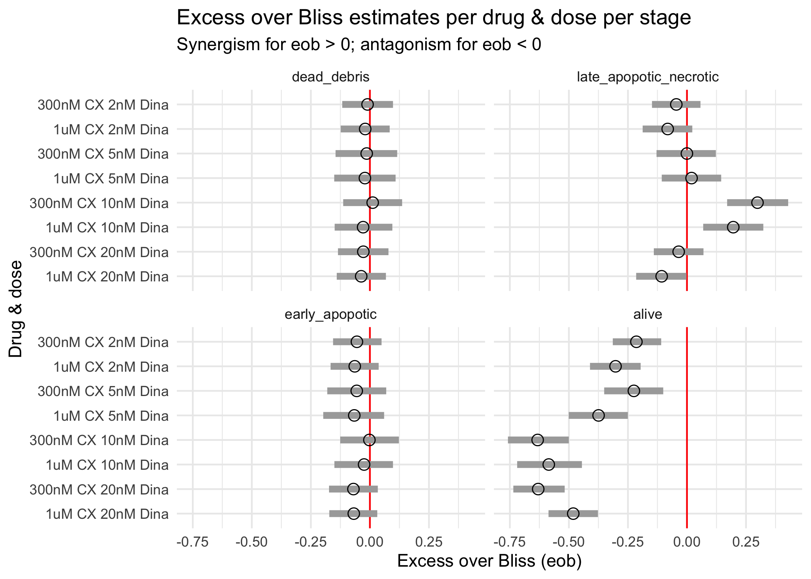

# excess_over_Bliss_analysis

The combination effect of two drugs at two fixed doses is characterised in terms of the excess over Bliss (eob). Following treatment of cells with CX-5461 and dinaciclib at fixed doses (both in combination and as single agents), the fraction of cells in different stages of apoptosis was determined. Measurements of different dose combinations were performed either in duplicates or in triplicates (unbalanced experimental design). Every replicate included a measurement of cell fractions following vehicle treatment to characterise a replicate-specific batch effect.

