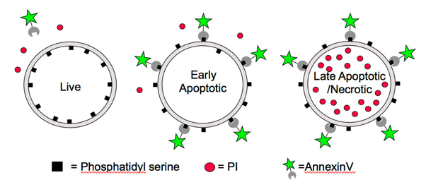

```{r setup, include=FALSE}
knitr::opts_chunk$set(echo = TRUE)
library(DT)
library(tidyverse)
library(readxl)
library(ggsci)
library(rstan)
library(broom)
options(mc.cores = parallel::detectCores())
rstan_options(auto_write = TRUE)

show_dt <- function(x, id = "") {
    datatable(
        x,
        filter = "top", 
        extensions = "Buttons",
        options = list(
            pageLength = 10,
            sDom = '<"top">Brt<"bottom">ip',
            buttons = list("copy", list(
                extend = "collection",
                buttons = list(
                    list(extend = "csv", filename = sprintf("data_%s", id)),
                    list(extend = "excel", filename = sprintf("data_%s", id))),
                text = "Download"))))
}
```


# Summary
The combination effect of two drugs at two fixed doses is characterised in terms of the excess over Bliss (eob). Following treatment of cells with CX-5461 and dinaciclib at fixed doses (both in combination and as single agents), the fraction of cells in different stages of apoptosis was determined. Measurements of different dose combinations were performed either in duplicates or in triplicates (unbalanced experimental design). Every replicate included a measurement of cell fractions following vehicle treatment to characterise a replicate-specific batch effect.


# Data



Four different stages

1. `stage = "alive"`: No staining
2. `stage = "early_apopotic"`: Cells with Annexin V staining
3. `stage = "late_apopotic_necrotic"`: Cells with Annexin V and PI staining
4. `stage = "dead_debris"`: Total number of cells (post QC-gating) minus the number of cells in stages `"alive"`, `"early_apoptotic"` and `"late_apopotic_necrotic"`, expressed as a fraction of the total number of cells (post QC-gating).

In the table, `value`s denote fractions of cells per `stage` at the given `drug_dose`.

```{r read-data, warning=F, message=F}
# Dose and stage levels
lvls_drug_dose <- c(
    "Vehicle", "300nM CX", "1uM CX", "2nM Dina", "5nM Dina", "10nM Dina",
    "20nM Dina", "300nM CX 2nM Dina", "1uM CX 2nM Dina", "300nM CX 5nM Dina",
    "1uM CX 5nM Dina", "300nM CX 10nM Dina", "1uM CX 10nM Dina",
    "300nM CX 20nM Dina", "1uM CX 20nM Dina")
lvls_combo <- c(
    "300nM CX 2nM Dina", "1uM CX 2nM Dina", "300nM CX 5nM Dina",
    "1uM CX 5nM Dina", "300nM CX 10nM Dina", "1uM CX 10nM Dina",
    "300nM CX 20nM Dina", "1uM CX 20nM Dina")
lvls_stage <- c(
    "dead_debris", "late_apopotic_necrotic", "early_apopotic", "alive")

# Read and clean data
# 1. Give meaningful stage levels
# 2. Remove NAs
# 3. Separate stage and replicate number
# 4. Transform from wide to long
# 5. Convert percentage to fraction
df <- "data_CX_dina.xlsx" %>%
    read_excel() %>%
    setNames(
        c("drug_dose", paste0(rep(lvls_stage, each = 3), "_rep", 1:3))) %>%
    pivot_longer(-drug_dose, names_to = "key") %>%
    filter(!is.na(value)) %>%
    separate(key, c("stage", "replicate"), sep = "_(?=rep)") %>%
    mutate(value = value / 100)

# Show data
df %>% 
    pivot_wider(names_from = replicate, values_from = value) %>%
    arrange(stage, factor(drug_dose, lvls_drug_dose)) %>%
    show_dt("raw") %>%
    formatRound(columns = 3:5, digits = 3)
```

# Vehicle normalisation

Normalise fractions per `replicate` to the lowest fraction following vehicle treatment per `stage`

$$
\widehat{f}_{ijk} = C_{jk} f_{ijk} = \frac{\max_{j} f_{\text{vehicle},jk}}{f_{\text{vehicle}, jk}} f_{ijk}\,,
$$

where

- $i$ denotes the `drug_dose` combination, e.g. `drug_dose = "300nM CX", "300nM CX 2nM Dina", ...`
- $j$ denotes the `replicate`, e.g. `replicate = "rep1", "rep2", ...`
- $k$ denotes the `stage`, e.g. `stage = "dead_debris", "alive", ...`

Example:

Drug & dose | Replicate 1 | Replicate 2
------------|-------------|-------------
Vehicle     |	0.085     |	0.29
300nM CX    |	0.68      |	3.17
1uM CX      |	1.38      |	9.45

Replicate 2 has the highest vehicle treatment effect (i.e. fraction of cells affected); then values for replicate 1 are scaled (multiplied) by 0.29 / 0.085

Drug & dose | Replicate 1 | Replicate 2
------------|-------------|-------------
Vehicle     |	0.29 / 0.085 × 0.085 = 0.29    |	0.29
300nM CX    |	0.29 / 0.085 × 0.68 = 2.32     |	3.17
1uM CX      |	0.29 / 0.085 × 1.38 = 4.708235 |	9.45

The normalisation procedure scales all values from replicates according to values from the replicate with the largest vehicle treatment effect. 

Notes:

1. The adopted normalisation procedure allows the comparison of normalised fractions within `stage`. It does not allow a comparison of fractions between `stage`s. 
2. Different vehicle normalisation methods could be adopted. In this case, vehicle normalisation up-scales all fractions to that corresponding to the *largest* vehicle treatment effect (per `stage`). An alternative normalisation could down-scale values according to the smallest vehicle effect, or use the mean vehicle fraction across all replicates. Results should not critically depend on the chosen normalisation procedure. 

```{r data-norm, warning=F}
# Normalise data to max(vehicle) per stage to account for 
# between-replicates batch effect
df <- df %>%
    group_by(stage) %>%
    mutate(scaleFactor = max(value[drug_dose == "Vehicle"])) %>%
    group_by(stage, replicate) %>%
    mutate(value = value * scaleFactor / value[drug_dose == "Vehicle"]) %>%
    filter(drug_dose != "Vehicle") %>%
    select(-scaleFactor) %>%
    ungroup()

# Show data
df %>%
    pivot_wider(names_from = replicate, values_from = value) %>%
    arrange(stage, factor(drug_dose, lvls_drug_dose)) %>%
    show_dt("normalised") %>%
    formatRound(columns = 3:5, digits = 3)
    
# Show distribution of values
df %>%
    ggplot(aes(value, fill = stage)) +
    geom_histogram(bins = 40) +
    facet_wrap(~ stage) +
    scale_x_log10() +
    scale_fill_nejm() +
    theme_minimal() +
    labs(
        title = strwrap("Distribution of vehicle-normalised fractions"),
        subtitle = "Bin width = 0.1; notice the log10 scale on the x-axis",
        x = "Vehicle-normalised fraction",
        y = "Count",
        fill = "Stage") +
    theme(legend.position = "bottom")
ggsave("data_normalised_histogram.pdf", height = 5, width = 7)

# Show vehicle-normalised fractions for every drug_dose
df %>%
    mutate(drug_dose = factor(drug_dose, lvls_drug_dose)) %>%
    ggplot(aes(drug_dose, value)) + 
    geom_point(aes(colour = stage, label = replicate), show.legend = F) + 
    facet_wrap(~ stage) +
    theme_minimal() + 
    scale_colour_nejm() + 
    theme(axis.text.x = element_text(angle = 45, hjust = 1)) + 
    scale_y_log10() +
    labs(
        title = strwrap("Normalised fraction of cells per stage per drug+dose    
                        treatment"),
        subtitle = strwrap("Normalised to vehicle treatment; notice the log10 
                           scale on the y-axis", 10000),
        x = "Drug + dose", 
        y = "Vehicle-normalised fraction")
ggsave("data_normalised_per_replicate.pdf", height = 5, width = 7)
```

Observations and notes:

It seems that 20 nM dinaciclib administered as a single agent has the largest overall effect on cells. This suggests that it may be difficult to determine a synergistic effect of dinaciclib with other agents, due to the high efficacy of dinaciclib alone at that dose.


# Model

## Excess over Bliss (eob) definition

The [excess over Bliss (eob)](https://www.ncbi.nlm.nih.gov/pmc/articles/PMC4360667/) is defined within the [Bliss independence model](https://www.ncbi.nlm.nih.gov/pubmed/24492921) as

$$
\begin{aligned}
\text{eob} &= \widehat{f}_{\text{A + B}} - \widehat{f}_{A,B}\\
&= \widehat{f}_{\text{A + B}} + (1 - \widehat{f}_A) (1 - \widehat{f}_B) - 1\,,
\end{aligned}
$$
where $\widehat{f}_A$, $\widehat{f}_B$, $\widehat{f}_{A+B}$ are the normalised fractional inhibitions of single drugs $A$, $B$ and the combination $A+B$, respectively.

A combination effect is then expressed in terms of the eob as 
$$
\text{eob}
\begin{cases}
\gt 0, & \text{synergistic behaviour}\\
= 0,   & \text{additive behaviour}\\
\lt 0, & \text{antagonistic behaviour}\,.
\end{cases}
$$


## Reshape data for model

In the table, `mean_CI` is the replicate-averaged linear combination index and `mean_log_10` is the replicate-averaged log10-transformed combination index. Note that taking the average of log-transformed values is not the same as log-transforming the average of values; to calculate `mean_log_10`, CI values were first log10-transformed and then averaged. 

```{r data-eob}
# Calculate excess over Bliss (eob)
# Store as long data
df_stan <- df %>%
    group_split(isSingleAgent = !str_detect(drug_dose, ".M\\s.+M\\s")) %>%
    map(function(x) {
        if (!all(x$isSingleAgent)) {
            x <- x %>%
                separate(
                    drug_dose, into = c("A", "B"), sep = "\\s(?=\\d)",
                    remove = FALSE, fill = "right") %>%
                pivot_longer(A:B, values_to = "agent")
        }
        x %>% select(-isSingleAgent)
    }) %>%
    reduce(left_join, by = c("stage", "replicate", "agent" = "drug_dose")) %>%
    group_by(stage, drug_dose, replicate) %>%
    summarise(eob = unique(value.x) + prod(1 - value.y) - 1) %>%
    group_by(drug_dose) %>%
    mutate(drug_dose_idx = group_indices()) %>%
    group_by(stage) %>%
    mutate(stage_idx = group_indices()) %>%
    ungroup()

df_stan %>%
    group_by(stage, drug_dose) %>%
    summarise(mean_eob = mean(eob)) %>%
    show_dt("mean_eob") %>%
    formatRound(columns = 3, digits = 3)

df_stan %>%
    ggplot(aes(drug_dose, eob, colour = stage)) + 
    geom_point(aes(colour = stage), show.legend = F) + 
    facet_wrap(~ stage) +
    theme_minimal() + 
    scale_colour_nejm() + 
    theme(axis.text.x = element_text(angle = 45, hjust = 1)) +
    labs(
        title = strwrap("Excess over Bliss per stage per drug+dose treatment"),
        x = "Drug + dose", 
        y = "Excess over Bliss (eob)")
ggsave("eob_per_replicate.pdf", height = 5, width = 7)
```


## Model eob within Bayesian model with partial pooling 

A simple Bayesian model is used to estimate the mean eob per `drug_dose` per `stage`.

Assume the likelihood $p(\text{data} | \theta)$ of the excess over Bliss to be 
$$
\text{eob}_{ik} \sim \text{N}(\mu_{ik}, \sigma^2)
$$
where the mean eob parameters $\mu_{ik}$ per `drug_dose` per `stage` are partially pooled
$$
\mu_{ik} \sim \text{N}(\mu_{\text{eob}},\sigma_{\text{eob}})\,.
$$
Weakly informative priors are chosen as
$$
\begin{aligned}
\mu_{\text{eob}} &\sim N(0, 10)\\
\sigma_{\text{eob}} &\sim \text{Cauchy}(0, 2.5)\,.
\end{aligned}
$$
Partial pooling has the advantage of improving parameter estimates per `stage` and `drug_dose` by "learning" from all measurements.

The model is fit using [Stan/RStan](https://mc-stan.org/users/interfaces/rstan).

```{r rstan-fit}
mod <- stan_model(file = "model.stan")
fit <- sampling(mod, data = list(
    N = nrow(df_stan),
    J = length(unique(df_stan$drug_dose)),
    K = length(unique(df_stan$stage)),
    drug = df_stan$drug_dose_idx,
    stage = df_stan$stage_idx,
    eob = df_stan$eob))
```

## Robust model-derived eob estimates

```{r eob-results}
# Show linear CI estimates
df_res <- tidy(
    fit, pars = "mu", conf.int = TRUE) %>%
    mutate(term = str_remove_all(term, "(mu\\[|\\])")) %>%
    separate(term, c("drug_dose_idx", "stage_idx"), sep = ",", convert = T) %>%
    left_join(
        df_stan %>%
            group_by(drug_dose_idx, stage_idx, drug_dose, stage) %>%
            summarise(),
        by = c("stage_idx", "drug_dose_idx")) %>%
    mutate(
        drug_dose = factor(drug_dose, levels = rev(lvls_combo)),
        stage = factor(stage, levels = lvls_stage))

# Show model results
df_res %>% 
    select(stage, drug_dose, everything(), -ends_with("idx")) %>% 
    show_dt("stan_estimates") %>%
    formatRound(columns = 3:6, digits = 3)

# Plot results
df_res %>%
    ggplot(aes(estimate, drug_dose)) +
    geom_vline(xintercept = 0, colour = "red") +
    geom_segment(
        aes(x = conf.low, y = drug_dose, xend = conf.high, yend = drug_dose),
        colour = "darkgrey", size = 2) +
    geom_point(size = 3, shape = 21) +
    facet_wrap(~ stage) +
    theme_minimal() +
    labs(
        title = "Excess over Bliss estimates per drug & dose per stage",
        subtitle = strwrap("Synergism for eob > 0; antagonism for eob < 0", 10000),
        x = "Excess over Bliss (eob)", y = "Drug & dose")
ggsave("eob_estimates.pdf", height = 5, width = 7)
ggsave("eob_estimates.png", height = 5, width = 7)
```

The black open circles denote mean estimates, the grey horizontal bars are the 95% Bayesian credible intervals, and the red vertical line denotes eob = 0. Drug combination synergism and antigonism are characterised by values eob > 0 and eob < 0, respectively.  

# Appendix

## The effect of partial pooling

Partial pooling of `eob` values across `stage`s and `drug_dose`s has the effect of shrinking individual estimates towards the pooled (across `stage` and `drug_dose`) average.

```{r}
# Show mean eob estimates including CIs and simple averages
tidy(
    fit, pars = "mu", conf.int = TRUE) %>%
    mutate(term = str_remove_all(term, "(mu\\[|\\])")) %>%
    separate(term, c("drug_dose_idx", "stage_idx"), sep = ",", convert = T) %>%
    left_join(
        df_stan %>%
            group_by(drug_dose_idx, stage_idx, drug_dose, stage) %>%
            summarise(mean_eob = mean(eob)) %>%
            ungroup(),
        by = c("stage_idx", "drug_dose_idx")) %>%
    mutate(
        drug_dose = factor(drug_dose, levels = rev(lvls_combo)),
        stage = factor(stage, levels = lvls_stage)) %>%
    ggplot(aes(estimate, drug_dose)) +
    geom_vline(xintercept = mean(df_stan$eob), linetype = 3) +
    geom_segment(
        aes(x = conf.low, y = drug_dose, xend = conf.high, yend = drug_dose),
        colour = "darkgrey", size = 2) +
    geom_point(size = 3, shape = 21) +
    geom_point(aes(mean_eob, drug_dose), colour = "blue") +
    facet_wrap(~ stage) +
    theme_minimal()
```

Notice the mean estimates (black open circles) being shrunk towards the pooled average (vertical dashed line) in comparison to the simple unshrunken (naive) estimates (blue filled circles). Partial pooling provides more robust individual eob parameter estimates by learning from all observations, in particular when there are unqual number of observations per `stage` per `drug_dose` (unbalanced design) as is the case here. 

## The Bliss independence model

From [Zhao et al., J. Biomol. Screen 19, 817 (2014)](https://www.ncbi.nlm.nih.gov/pubmed/24492921):

> Suppose two drugs, A and B, both inhibit tumor growth: drug $A$ at dose $a$ inhibits $Y_a$ percent of tumor growth and drug $B$ at dose $b$ inhibits Yb percent of tumor growth. If two drugs work independently, the combined percentage inhibition $Y_{ab,P}$ can be predicted using the complete additivity of probability theory as $Y_{ab,P} = Y_a + Y_b - Y_a Y_b$. The observed combined percentage inhibition $Y_{ab,O}$ is then compared with $Y_{ab,P}$.

So the quantity of interest is
$$
\begin{aligned}
Y_{ab,O} - Y_{ab,P} &= Y_{ab,O} - Y_a - Y_b + Y_a Y_b \\
&= Y_{ab,O} - 1 + (1 - Y_a) (1 - Y_b) \\
&= eob
\end{aligned}
$$

## Drug synergy in the context of clinical relevance

Reference: [Assessing drug synergy in combination therapies, A. Palmer, Havard Medical School](http://lincs.hms.harvard.edu/wordpress/wp-content/uploads/2017/08/ICSB_Part3_Assessing_drug_combination.pdf)

Be aware of complicating factors:

1. Synergy of desired effect vs. synergy of toxic side effects
2. Synergy vs. individual drug potency
3. Synergy vs. slowing evolution of drug resistance
4. Synergy vs. addressing heterogeneity